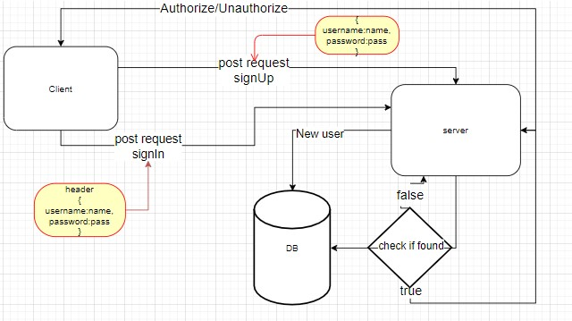

# basic-auth


# LAB - 06
---
### Deployment Test

###### Author: Ibrahem Alomari

* ##### [Actions](https://github.com/ibrahemomari/basic-auth/actions)

* ##### [Heroku](https://ibrahem-basic-api-server.herokuapp.com/)

---
###### Setup


### `.env`
 > PORT: 8000
 >NODE_ENV=test


---

###### Running the app:

* ####  `npm start` , `nodemon`

* #### Endpoint: */signin*
    * **Returns Object**

```javascript
{
    "username":"test",
    "password":"test"
}
```

* #### Endpoint: */signup*
* **Returns Object**

```javascript
{
    "username":"test",
    "password":"test"
}
```

---

#### Tests
Unit Tests: `npm run test`
Lint Tests: `npm run lint`

---

#### UML

;